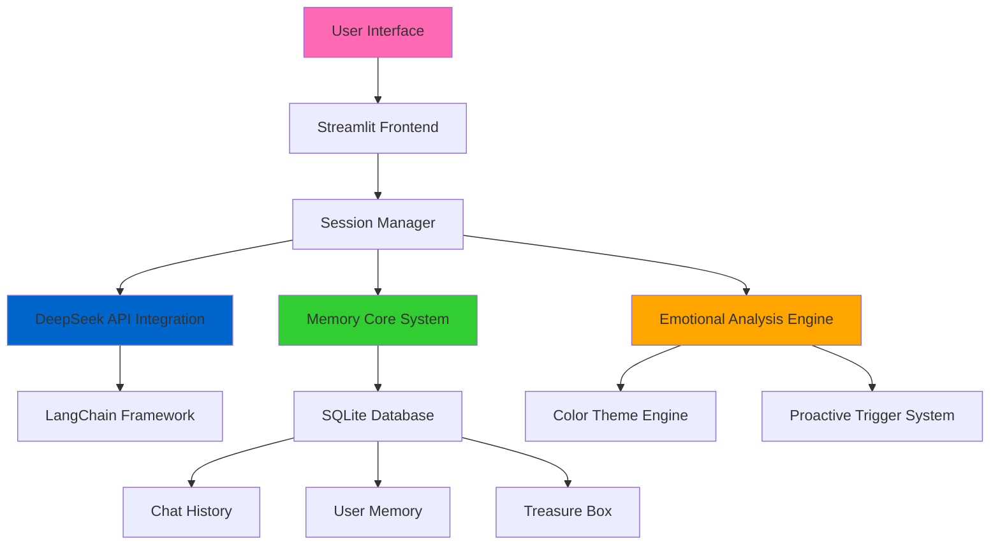

# 🌟 MindSprite AI - Enterprise Emotional Companion Agent

<div align="center">


**Advanced Proactive Emotional AI Agent with Multi-Modal Interaction Capabilities**

[🚀 Quick Start](#-quick-start) • [✨ Features](#-features) • [🏗️ Architecture](#️-architecture) • [📊 Demo](#-demo) • [🤝 Contributing](#-contributing)

</div>

---

## 📋 Overview

**MindSprite AI** is a next-generation emotional companion agent featuring the adorable sprite 小念. Leveraging advanced AI capabilities to provide proactive, empathetic, and personalized emotional support. Built with enterprise-grade architecture and modern AI frameworks, it represents the cutting edge of human-AI emotional interaction.

### 🎯 Core Value Proposition

- **Proactive Engagement**: AI-driven initiative in emotional support
- **Multi-Modal Expression**: Visual, textual, and interactive emotional representation
- **Personalized Experience**: Adaptive responses based on user patterns
- **Memory-Driven Intelligence**: Context-aware conversations with long-term memory
- **Enterprise Security**: Privacy-first design with user-controlled API keys

---

## ✨ Features

### 🧠 Advanced AI Capabilities

| Feature | Description | Technology |
|---------|-------------|------------|
| **Proactive Mood Detection** | Automatic emotional state recognition and initiative | DeepSeek LLM + Pattern Analysis |
| **Streaming Thought Process** | Real-time AI reasoning visualization | Custom Streaming Architecture |
| **Memory Core System** | Long-term conversation memory and relationship building | SQLite + Vector Memory |
| **Emotional Color Mapping** | Visual mood representation through color theory | CSS3 + Dynamic Theming |
| **Treasure Box Collection** | Memorable moment preservation and recall | Database + Metadata Storage |

### 🎨 User Experience Excellence

- **🌸 Adaptive UI**: Dynamic theme switching based on emotional context
- **💬 Natural Conversation**: Context-aware dialogue with personality
- **🎁 Surprise Mechanics**: Easter eggs and special occasion responses
- **📱 Responsive Design**: Optimized for desktop and mobile experiences
- **🔐 Privacy-First**: No server-side API key storage, full user control

---

## 🏗️ Architecture

### System Architecture



### Technology Stack

**Frontend & UI**
- `Streamlit` - Modern web app framework
- `Custom CSS` - Advanced styling and animations
- `HTML5` - Semantic markup and accessibility

**AI & Language Processing**
- `LangChain` - LLM orchestration and chaining
- `DeepSeek API` - Advanced language model
- `Custom Prompts` - Specialized emotional intelligence prompts

**Data & Memory**
- `SQLite` - Lightweight, embedded database
- `Session State` - Real-time state management
- `JSON` - Structured data serialization

**Development & Deployment**
- `Python 3.8+` - Core runtime environment
- `Git` - Version control and collaboration
- `pip` - Package management

---

## 🚀 Quick Start

### Prerequisites

- Python 3.8 or higher
- DeepSeek API Key ([Get yours here](https://platform.deepseek.com))
- 4GB+ RAM recommended

### Installation

1. **Clone the Repository**
   ```bash
   git clone https://github.com/yourusername/mindsprite-ai.git
   cd mindsprite-ai
   ```

2. **Install Dependencies**
   ```bash
   pip install -r requirements.txt
   ```

3. **Launch the Application**
   ```bash
   streamlit run app.py
   ```

4. **Access the Interface**
   - Local: `http://localhost:8501`
   - Network: `http://your-ip:8501`

### First Time Setup

1. Open the application in your browser
2. Navigate to the sidebar configuration panel
3. Input your DeepSeek API key in the secure field
4. Begin your emotional companion journey

---

## 📊 Demo

### Core Interactions

**Proactive Greeting System**
```
🧠 Detecting first visit today, initiating proactive greeting
🧠 Analyzing current time (evening) for contextual response
🧠 Selecting warm theme colors for comfort atmosphere
🧠 Preparing warm companionship as greeting gift
🧠 Expressing care and companionship in gentle tone
💖 Good evening! 🌙 Hope you're having a wonderful rest day~
Today is also a day full of possibilities! Whatever you encounter, 
MindSprite will be here to accompany you~ ✨
```

**Emotional Analysis & Response**
```
Input: "I'm feeling a bit overwhelmed with work today"

🧠 Analyzing emotional keywords: 'overwhelmed', 'work'
🧠 Detecting stress and fatigue patterns
🧠 Selecting calming blue theme for stress relief
🧠 Preparing relaxation gift and supportive response
🧠 Crafting empathetic response with practical suggestions
💖 I understand that feeling of being overwhelmed 💙
Let's take a deep breath together~ Work can be demanding, 
but you're doing great. Would you like to share what's 
weighing on your mind most?
```

---

## 🔧 Configuration

### Environment Variables

The application uses **user-provided API keys** instead of environment variables for enhanced security:

```javascript
// No .env file required
// API keys are managed through the UI
// Session-based storage only
```

### Advanced Configuration

**Memory Settings**
- Context window: 6 turns default
- Memory limit: 5 core memories per session
- Treasure box capacity: 20 items per user

**UI Customization**
- Theme adaptation based on emotional context
- Color psychology integration
- Responsive breakpoints for mobile optimization

---

## 🤝 Contributing

We welcome contributions from the community! Please see our contributing guidelines:

### Development Workflow

1. Fork the repository
2. Create a feature branch (`git checkout -b feature/amazing-feature`)
3. Commit your changes (`git commit -m 'Add amazing feature'`)
4. Push to the branch (`git push origin feature/amazing-feature`)
5. Open a Pull Request

### Code Standards

- Follow PEP 8 Python style guidelines
- Include docstrings for all functions
- Add unit tests for new features
- Maintain backward compatibility

---

## 📄 License

This project is licensed under the MIT License - see the [LICENSE](LICENSE) file for details.

---

## 🌐 Links & Resources

- **Official Website**: [mindsprite.ai](https://mindsprite.ai)
- **Documentation**: [docs.mindsprite.ai](https://docs.mindsprite.ai)
- **DeepSeek Platform**: [platform.deepseek.com](https://platform.deepseek.com)
- **LangChain Docs**: [langchain.com](https://langchain.com)

---

## 📞 Support

**Enterprise Support**: enterprise@mindsprite.ai  
**Community Discord**: [discord.gg/mindsprite](https://discord.gg/mindsprite)  
**GitHub Issues**: [Submit a bug report](https://github.com/yourusername/mindsprite-ai/issues)

---

<div align="center">

**Built with ❤️ by the MindSprite AI Team**

*Redefining Human-AI Emotional Connection*

</div>
