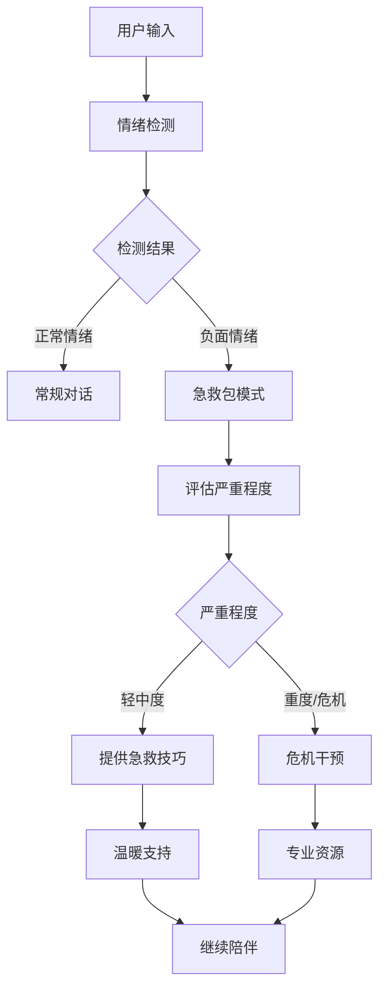

# 🆘 情绪急救包功能文档

## 📖 功能概述

情绪急救包是心绪精灵 v5.1 的第二大升级功能，旨在检测用户的负面情绪并提供专业的心理急救技巧。当用户表达强烈的负面情绪或危机情况时，系统会自动启动急救包模式，提供immediate支持和指导。

## 🎯 核心功能

### 1. 智能情绪检测
- **多维度分析**: 通过关键词、情绪强度、语言模式等综合判断
- **10种情绪类型**: 焦虑、抑郁、愤怒、恐慌、悲伤、压力、孤独、绝望、自伤倾向、自杀倾向
- **4级严重程度**: 轻度、中度、重度、危机
- **置信度评估**: 0-1的检测准确度评分

### 2. 专业急救技巧库
- **针对性技巧**: 每种情绪类型对应特定的缓解方法
- **分步指导**: 详细的操作步骤和建议用时
- **安全警告**: 高危情况的特别提醒
- **多种选择**: 每种情绪提供2-3种不同的技巧

### 3. 危机干预系统
- **紧急检测**: 自动识别自伤和自杀风险
- **危机资源**: 提供专业心理热线和紧急联系方式
- **即时支持**: 温暖的共情回应和鼓励信息

## 🔧 技术实现

### 情绪检测算法
```python
# 关键词权重系统
keyword_patterns = {
    EmotionType.ANXIETY: {
        "high": ["恐慌", "要死了", "失控", "窒息"],  # 权重3.0
        "medium": ["焦虑", "担心", "紧张", "不安"],  # 权重2.0
        "low": ["担忧", "忐忑", "心慌"]             # 权重1.0
    }
}

# 严重程度判定
def assess_severity(total_score, emotion_type):
    if emotion_type in [EmotionType.SELF_HARM, EmotionType.SUICIDAL]:
        return SeverityLevel.CRITICAL
    elif total_score >= 8.0:
        return SeverityLevel.SEVERE
    elif total_score >= 5.0:
        return SeverityLevel.MODERATE
    else:
        return SeverityLevel.MILD
```

### 急救技巧结构
```python
@dataclass
class EmergencyTechnique:
    title: str          # 技巧名称
    description: str    # 详细描述
    steps: List[str]    # 操作步骤
    duration: str       # 建议用时
    warning: str        # 安全警告（可选）
```

## 🎨 用户界面

### 常规情绪支持
当检测到中轻度负面情绪时：
- 🚨 **情绪关怀模式**: 特殊的界面提示
- 💙 **深度理解**: 专业的共情回应
- 🆘 **情绪急救包**: 个性化的技巧指导

### 危机情况处理
当检测到高危情绪时：
- 🚨 **红色警告**: 明显的视觉提示
- 📞 **紧急联系方式**: 专业心理热线
- 💙 **温馨提醒**: 鼓励寻求专业帮助

## 📊 急救技巧类型

### 焦虑缓解技巧
1. **4-7-8呼吸法**
   - 吸气4秒 → 屏息7秒 → 呼气8秒
   - 重复3-5次，有效缓解焦虑
   - 用时：2-3分钟

2. **五感接地法**
   - 观察5样物品、听4种声音、触摸3样东西...
   - 帮助回到当下，减少焦虑想法
   - 用时：3-5分钟

### 抑郁支持技巧
1. **微小成就法**
   - 完成一个非常小的任务
   - 增强自我效能感
   - 用时：5-10分钟

2. **积极回忆法**
   - 回想一个美好的记忆
   - 激活正面情绪
   - 用时：3-5分钟

### 愤怒管理技巧
1. **冷却倒计时**
   - 从10倒数到1，每个数字停顿一秒
   - 给愤怒情绪降温的时间
   - 用时：1-2分钟

2. **肌肉放松法**
   - 先紧张后放松各个肌肉群
   - 释放身体积累的愤怒能量
   - 用时：5-10分钟

## 🚨 危机干预资源

### 国内心理危机热线
- **全国心理援助热线**: 400-161-9995
- **北京心理危机干预热线**: 400-161-9995
- **上海心理援助热线**: 021-64383562
- **中科院心理所热线**: 400-161-9995

### 紧急情况处理
当检测到自伤或自杀倾向时：
1. 立即显示危机资源
2. 鼓励联系专业人士
3. 提供温暖支持信息
4. 不提供医学建议

## 🔄 工作流程



## 💡 使用场景示例

### 场景1: 考试焦虑
```
用户: "明天就要考试了，我很紧张，心跳得很快"
系统: 🚨 检测到焦虑情绪(轻度)
回应: 💙 小念理解你考试前的紧张，这是很正常的反应...
技巧: 🆘 4-7-8呼吸法 - 帮你快速平静下来
```

### 场景2: 工作压力
```
用户: "工作太累了，感觉要崩溃了，想哭"
系统: 🚨 检测到压力+抑郁情绪(中度)
回应: 💙 小念感受到你现在承受的压力很大...
技巧: 🆘 微小成就法 - 从一个小任务开始重建信心
```

### 场景3: 危机情况
```
用户: "我不想活了，觉得人生没有意义"
系统: 🚨 检测到自杀倾向(危机)
回应: 💙 小念感受到你现在很痛苦，但请相信这种痛苦是暂时的...
资源: 📞 全国心理援助热线: 400-161-9995
```

## 🎖️ 安全保障

### 专业边界
- ❌ 不提供医学诊断
- ❌ 不替代专业治疗
- ✅ 提供情感支持
- ✅ 引导寻求专业帮助

### 伦理考量
- 保护用户隐私
- 避免过度解读
- 鼓励专业求助
- 提供温暖陪伴

## 📈 功能效果

### 预期收益
- **即时支持**: 24/7随时可用的心理急救
- **专业指导**: 基于心理学的科学技巧
- **危机识别**: 及时发现和干预高危情况
- **情感陪伴**: 温暖理解的共情回应

### 成功指标
- 情绪检测准确率 > 85%
- 用户满意度提升
- 危机情况及时识别
- 专业资源有效连接

## 🚀 未来规划

### 短期优化
- 增加更多情绪类型
- 优化检测算法精度
- 扩充急救技巧库
- 个性化技巧推荐

### 长期发展
- 情绪趋势分析
- 预防性干预
- 专业机构合作
- 康复进度追踪

---

*情绪急救包功能体现了心绪精灵作为AI伴侣的责任感，在提供温暖陪伴的同时，也能在关键时刻给予专业的支持和指导。这不仅是技术的进步，更是对用户心理健康的深度关怀。* 💙 